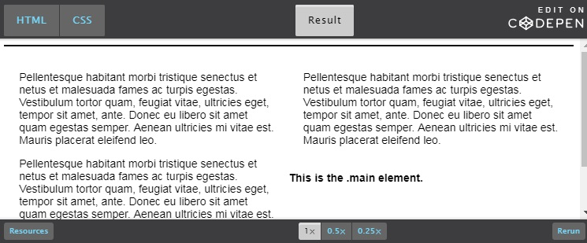
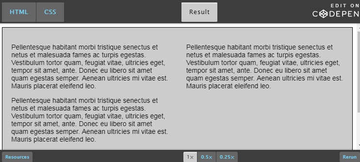

# Advanced CSS

* Planning and designing a layout: Wireframe designs
* Build a semantic HTML and CSS foundation
* Analyze style guides to build your base CSS
* Use Media queries to create responsive grid system

## Responsive Layout

Ability of website to response for different electronic devices no matter screen sizes, orientation, browser window size etc.

Media queries look at the capability of the device : 
* Width and height of viewport
* Width and height of device
* Page Orientation
* Resolution

Most common used media queries are :
* min-width
* max-width
* min-height
* max-height
* orientation:portrait
* orientation:landscape

To use : 
  ```CSS
  // CSS to hide mobile toggle button for desktop device
  // On Screen that are 768px wide or more
  @media screen and (min-width: 768px) {
      .btn-mobile-toggle {
          display: none;
      }
  } 
  ```

### Device breakpoints : 
```CSS
/* Extra small devices (phones, up to 480px) */
@media screen and (max-width: 767px) { ... }  

/* Small devices (tablets, 768px and up) */
@media (min-width: 768px) and (max-width: 991px) { ... }  

/* tablets/desktops and up */
@media (min-width: 992 px) and (max-width: 1199px) { ... }  

/* large like desktops and up */
@media screen and (min-width: 1200px) { ... }  
```

Remember to design your website's layout for the smallest device first, and progressively enlarge the layout design as more screen area becomes available.
For devices with large screens, best to limit maximum width of the container panel
```CSS
// css for main container
.container {
    max-width: 62.5rem; /* rem or em relative unit*/
} 
```
### Grid vs Flexbox
| Grids                                            |                                              Flexbox       |
| ------------------------------------------------ | ---------------------------------------------------------- |
| Works well with layout in 2 dim rows and columns | Lay out items in single dimension, either in row or column, hence allows the content to control the way it is displayed rbr or cbc |
| Best suited for organizing layout of higher-level elements like headers, sections, asides and footers | Best suited for targeting the position of child elements and their spatial relationship within a parent element  |
| Divides a web page into columns and rows, based on size, position, and layer to position and size the building block elements | In this the children of a Flexbox container can be laid out in any direction, and can flex their sizes, either growing to fill unused space or shrinking to avoid overflowing the parent |
| Gives flexibility to use CSS to change position of elements without changing HTML |  can easily manipulate both horizontal and vertical alignment of the children elements | 
| Absence of content structure in the grid helps manage changes to the layout by using fluid and source order independent layout techniques. | You can build layouts in two dimensions by nesting the page elements (horizontal inside vertical or vertical inside horizontal).  | 
* Both requires a parent container that manipulates the position of child elements
* Essentially, if you have many items and don’t need them to line up with any other elements on the page, but just want them displayed evenly and flexibly, you want to use Flexbox.
* Check : https://caniuse.com/#feat=flexbox
* Use the Grid layout for the main page structure of rows and columns, and use Flexbox for navigation, UI elements, and any other web page items that work better with a linear layout.
* Grid is appropriate for overall page layout, and for complicated page components that aren’t linear in their design.
* Flexbox is appropriate for many layouts, and many page component elements, since most of them are fundamentally linear.

### Images

To use an image : 
`img height="##" width="##" src="iamge.gif" alt="##">`  
By specifying the acutal dimensions of the image, the web page will load with correct amount of space allocated to the image. Otherwise, the image will download, causing the page to move down and rearrange for every image that subsequently downloads. 

#### To make an image responsive to the container it is in set the width to 100%:
```CSS
img {
    max-width: 100%;
    height: auto;
}
```


## Base CSS

#### What is **Base CSS** ?

It contains Base rules which defines the default styling for a specific element in all occurrences of that element on your web page.  
Like : heading sizes, default link styles, default font styles, body backgrounds.


We use style guide to set up a base CSS. 


#### But, what is **Style Guide** ?

Often provided by the graphic designer. We use them to identify design patterns, common element styles, colors, padding and margins, page layout and more.

Style guide consists of : 
* **Templates** : Basic elements that serves as the foundation of web page like color palette, fonts, headers, footers, body text, navigation, widgets and grid layouts.
* **Patterns** : Includes buttons, logos, images, the font icon library, and form styles. 
* **Documentation** : Record of the style and development patterns of the web page. Adding comments in your code that server as style guide/ interactive modals/ tool tips.

We also include **CSS Reset** in our base, which defines a consistent foundation across browsers upon which to build our websites. By using a reset.css file we essentially overwrite the browsers default rules.

<!-- 

img[src*="#thumbnail"] {
   width:100px;
   height:1px;
} -->


Move along.


## Planning and designing a layout

* **Analyze high fidelity designs for issues and opportunities**
* **Analyze designs and column layout :** Use wireframe design to help us see the site in terms of layout and containing boxes.

## Build a semantic HTML and CSS foundation

#### Setup the CSS file by adding reset files
Add the reset file : normalize.css. Refer http://nicolasgallagher.com/about-normalize-css/  
We change the box sizing to border box. Refer : https://www.paulirish.com/2012/box-sizing-border-box-ftw/  

#### Link the CSS stylesheet

#### Build the wireframe structures with background colors
From the wireframe diagram check the color we need and add the color classes. Use them to create the structure in html based on the wireframe divide the html page into sections along with header and footers.

For example in this case:

```CSS
/*Theme Styles*/
.background-primary {
  background: #F7941E; /*Orange*/
}
.background-secondary {
  background: #00AEEF; /*Blue*/
}
.background-tertiary {
  background: #8DC63F; /*Green*/
} 
```
```html
<!-- Different sections and their color based on wireframe -->
<header class="background-primary">Header Content</header>
    <main>
        <section class="background-secondary">Hero Primary Content</section>
        <section>Image and Text Content</section>
        <section>Featured Content</section>
        <section class="background-primary">Testimonial Content</section>
        <section class="background-secondary">Media Objects</section>
        <section class="background-tertiary">More Content</section>
    </main>
    <footer class="background-primary">Footer Content</footer>
```

## Analyze style guides to build your base CSS

#### Style guides and redlines
* Style guide helps identifying the elements (`mostly text their color and their font style, size`) and styles that we can add to the **base**. Either look at the website and create them or use them to verify with the website.  
* Redlines gives the dimension, alignment, opacity, hover state of each content of the webpage.

For example in our case :
`/*base style*/`
* body
* h1, h2, h3
* specify a style to base \<a\> element

## Use Media queries to create responsive grid system

#### container class
* Since our large device breakpoint is `1200px` so, `max-width + left padding + right padding = 1200px`.  
* Setting left and right `15px padding` to make sure our content does not run directly to the edge and to set up the base of our 30px grid gutter.
* Sets the margin to auto center the container screen.
* Wrap the content of every section, header, footer within the container class.

``` CSS
/* Layout styles */
.container {
    padding-right: 15px;
    padding-left: 15px;
    margin-right: auto;
    margin-left: auto;
    max-width: 1170px;
}
```

```html
Hero Primary Content
to 
<div class="container"> Hero Primary Content </div>
```
#### Create a simple grid system

##### Concept of Negative margin


The yellow box has a negative top margin of 10px and a negative left margin of 10px. The “buy now” button has a negative right margin of 10px and a negative bottom margin of 10px

##### Clearing floats 
Ref: https://www.sitepoint.com/clearing-floats-overview-different-clearfix-methods/

Nowadays more commonly knows as "Clearfix methods".  

Problems that **Clearfix methods** solves:
* **Scenario** : `.e1-1` and `.e1-2` are floated side by side inside a `.container` element, and there's a `.main` element after `.container`
    * **Desired outcome** : We want `.container` to expand the height of its child elements (i.e. the taller of either `.e1-1` or `.e1-2`), and we want `.main` to be after `.container`
    * **Actual outcome** : `.container` collapses and takes on no height at all, as if there is nothing inside it, putting `.main` in an undesired location and potentially causing any backgrounds or borders on `.container` to be missing.
        ``` html
        The html file : 

        <div class="container">
            <div class="el-1">A long string of stuff here...</div>
            <div class="el-2">A short string of stuff here...</div>
        </div>
        <div class="main">
            Some stuff here...
        </div>
        ```
        ``` CSS
        The CSS file : 

        .el-1, .el-2 {
            float: left;
            width: 50%;
        }

        .el-1 {
        /* styles for .el-1 here */
        }

        .el-2 {
        /* styles for .el-2 here */
        }

        .main {
        /* styles for .main here */
        }
        ```
        It will look like 
        

    * **The "Clear" property** : It specifies whether an element can be next to floating elements that precede it or must be moved down (cleared) below them.
    
    * **Solution 1** : Insert an empty element that has the `clear` property declared on it at the bottom of the container of floated elements.   
    In this if we don't care about collapsed container, an only about the mis-positioned `.main` element, then we could also choose to place the "cleared" element after the container. But if chose to do that, might as well just put the `clear:both` declaration on the `.main` itself.
        ``` CSS
        .clear {
            clear: both;
        }
        ```
        ```html
        <div class="container">
            <div class="el-1">I'm floated...</div>
            <div class="el-2">I'm also floated...</div>
            <br class="clear">
        </div>

        <div class="main">
            Bravo, sirs and madams. I'm in the clear.
        </div>
        ```
          


    * **Solution 2: The Overflow way** : Using `overflow` property on our `.container`, we can actually force the container to expand to the height of the floated elements.
    So, here `.container` expands to the height of our floated elements, background colors, and background images will fill it up if applied.  
    **Drawback** : Any child content that pokes outside the container element is going to either get clipped (if `hidden`) or is going to cause scrollbars to appear (if `auto`)
        ```CSS
        .container {
            overflow: hidden; /* can also be "auto" */
        }

        No changes in html
        ```

    * **Solution 3: The Clearfix class** : This will force the container element to expand, pusing subsequent elements beneath it. It works using CSS pseudo-elements `::before` and `::after`  
    Ref : http://nicolasgallagher.com/micro-clearfix-hack/ generates pseudo-elements and sets their display to table. This creates an anonymous table-cell … The :after pseudo-element is used to clear the floats. As a result … the total amount of code needed is reduced.

        ```CSS
        .clearfix:before,
        .clearfix:after {
            content: "";
            display: table;
        }

        .clearfix:after {
            clear: both;
        }

        .clearfix {
            zoom: 1; /* ie 6/7 */
        }


        /* if you don’t need to support anything below IE8,*/
        .clearfix:after {
        content: "";
        display: table;
        clear: both;
        }
        ```
        ```HTML
        <div class="container clearfix">
            <div class="el-1">I'm floated...</div>
            <div class="el-2">I'm also floated...</div>
        </div>

        <div class="main">
            Bravo, sirs and madams. I'm in the clear.
        </div>  
        ```

    * **Solution 4: The Future `contain-floats` value** : Does same thing with single line of code.
        ``` CSS
        .container {
            min-height: contains-float;
        }
        ```

    


For eg. in our case :  

##### To create a row :
``` CSS
/* Layout styles */
.row {
    margin-right: -15px;
    margin-left: -15px;
}
/* Since the .container has padding of 15px, we add a margin of -15px to the .row to make it flush with the .container. */

.row:after {
  content: "";
  display: table;
  clear: both;
}

```

##### To create a column :
Define a CSS selector that targets all classes that start with `.col-`  
Various ways to select elements : https://www.w3schools.com/cssref/css_selectors.asp

``` CSS
[class*='col-'] {
    width: 100%;
    padding-left: 15px;
    padding-right: 15px;
}

/* Media Query excludes extra small devices and includes small and above */
@media (min-width: 48em) {
    /* This will get your columns stack horizontally when the screen is small and above */
    /* But they won't because their width is 100%, so add column third and two third */
    [class*='col-'] {
        float: left;
    }
    /* Column Third */
    .col-1-3 {
        width: 33.3333%;
    }
    /* Column Two Thirds */
    .col-2-3 {
        width: 66.6666%;
    }
}
```

##### Build a row and column in your HTML: 
Since, we are building this site mobile first stacking our html that way:
Replacing Image and Text Content section with :
```html
<section>
    <div class="container">
        <div class="row">
            <div class="col-1-3">
                Circle Image
            </div>
            <div class="col-2-3">
                Content Area
            </div>
        </div>
    </div>
</section>
```

##### Responsive solution to flip two columns:
since the columns are wrong for devices small and above.

``` CSS
@media (min-width: 48em) {
    .pull-right-sm {
        float:right;
    }
}
```

```html
<div class="row">
    <div class="col-1-3 pull-right-sm">
        Circle Image
    </div>
    <div class="col-2-3">
        Content Area
    </div>
</div>
```

##### Make a three column grid :
Create three column sections
```html
<section>
    <div class="container">
        <div class="row">
            <div class="col-1-3">
                <div class="background-secondary">
                    Feature Content
                </div>
            </div>
            <div class="col-1-3">
                <div class="background-secondary">
                    Feature Content
                </div>
            </div>
            <div class="col-1-3">
                <div class="background-secondary">
                    Feature Content
                </div>
            </div>
        </div>
    </div>
</section>
```

##### Column flush with extra small devices only:
Stack content so that it is flush with the window and remove any margin padding.

``` CSS
@media only screen and (max-width : 47.9375em) {
    .remove-gutter-xs {
        padding-left: 0px;
        padding-right: 0px;
    }
}
```

```html
<div class="container">
    <div class="row">
        <div class="col-1-3 remove-gutter-xs">
            <div class="background-secondary">
                Feature Content
            </div>
        </div>
        <div class="col-1-3 remove-gutter-xs">
            <div class="background-secondary">
                Feature Content
            </div>
        </div>
        <div class="col-1-3 remove-gutter-xs">
            <div class="background-secondary">
                Feature Content
            </div>
        </div>
    </div>
</div>
```