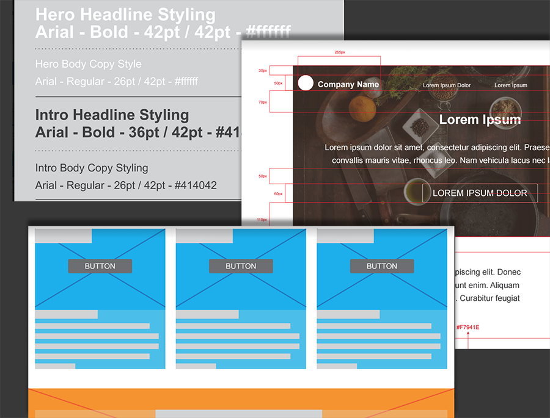

# Advanced CSS

* Planning and designing a layout: Wireframe designs
* Build a semantic HTML and CSS foundation
* Analyze style guides to build your base CSS
* Use Media queries to create responsive grid system

## Responsive Layout

Ability of website to response for different electronic devices no matter screen sizes, orientation, browser window size etc.

Media queries look at the capability of the device : 
* Width and height of viewport
* Width and height of device
* Page Orientation
* Resolution

Most common used media queries are :
* min-width
* max-width
* min-height
* max-height
* orientation:portrait
* orientation:landscape

To use : 
  ```CSS
  // CSS to hide mobile toggle button for desktop device
  // On Screen that are 768px wide or more
  @media screen and (min-width: 768px) {
      .btn-mobile-toggle {
          display: none;
      }
  } 
  ```

### Device breakpoints : 
```CSS
/* Extra small devices (phones, up to 480px) */
@media screen and (max-width: 767px) { ... }  

/* Small devices (tablets, 768px and up) */
@media (min-width: 768px) and (max-width: 991px) { ... }  

/* tablets/desktops and up */
@media (min-width: 992 px) and (max-width: 1199px) { ... }  

/* large like desktops and up */
@media screen and (min-width: 1200px) { ... }  
```

Remember to design your website's layout for the smallest device first, and progressively enlarge the layout design as more screen area becomes available.
For devices with large screens, best to limit maximum width of the container panel
```CSS
// css for main container
.container {
    max-width: 62.5rem; /* rem or em relative unit*/
} 
```
### Grid vs Flexbox
| Grids                                            |                                              Flexbox       |
| ------------------------------------------------ | ---------------------------------------------------------- |
| Works well with layout in 2 dim rows and columns | Lay out items in single dimension, either in row or column, hence allows the content to control the way it is displayed rbr or cbc |
| Best suited for organizing layout of higher-level elements like headers, sections, asides and footers | Best suited for targeting the position of child elements and their spatial relationship within a parent element  |
| Divides a web page into columns and rows, based on size, position, and layer to position and size the building block elements | In this the children of a Flexbox container can be laid out in any direction, and can flex their sizes, either growing to fill unused space or shrinking to avoid overflowing the parent |
| Gives flexibility to use CSS to change position of elements without changing HTML |  can easily manipulate both horizontal and vertical alignment of the children elements | 
| Absence of content structure in the grid helps manage changes to the layout by using fluid and source order independent layout techniques. | You can build layouts in two dimensions by nesting the page elements (horizontal inside vertical or vertical inside horizontal).  | 
* Both requires a parent container that manipulates the position of child elements
* Essentially, if you have many items and don’t need them to line up with any other elements on the page, but just want them displayed evenly and flexibly, you want to use Flexbox.
* Check : https://caniuse.com/#feat=flexbox
* Use the Grid layout for the main page structure of rows and columns, and use Flexbox for navigation, UI elements, and any other web page items that work better with a linear layout.
* Grid is appropriate for overall page layout, and for complicated page components that aren’t linear in their design.
* Flexbox is appropriate for many layouts, and many page component elements, since most of them are fundamentally linear.

### Images

To use an image : 
`img height="##" width="##" src="iamge.gif" alt="##">`  
By specifying the acutal dimensions of the image, the web page will load with correct amount of space allocated to the image. Otherwise, the image will download, causing the page to move down and rearrange for every image that subsequently downloads. 

#### To make an image responsive to the container it is in set the width to 100%:
```CSS
img {
    max-width: 100%;
    height: auto;
}
```


## Base CSS

#### What is **Base CSS** ?

It contains Base rules which defines the default styling for a specific element in all occurrences of that element on your web page.  
Like : heading sizes, default link styles, default font styles, body backgrounds.


We use style guide to set up a base CSS. 


#### But, what is **Style Guide** ?

Often provided by the graphic designer. We use them to identify design patterns, common element styles, colors, padding and margins, page layout and more.

Style guide consists of : 
* **Templates** : Basic elements that serves as the foundation of web page like color palette, fonts, headers, footers, body text, navigation, widgets and grid layouts.
* **Patterns** : Includes buttons, logos, images, the font icon library, and form styles. 
* **Documentation** : Record of the style and development patterns of the web page. Adding comments in your code that server as style guide/ interactive modals/ tool tips.

We also include **CSS Reset** in our base, which defines a consistent foundation across browsers upon which to build our websites. By using a reset.css file we essentially overwrite the browsers default rules.

<!-- 

img[src*="#thumbnail"] {
   width:100px;
   height:1px;
} -->



Move along.


## Planning and designing a layout

* **Analyze high fidelity designs for issues and opportunities**
* **Analyze designs and column layout :** Use wireframe design to help us see the site in terms of layout and containing boxes.

## Build a semantic HTML and CSS foundation

#### Setup the CSS file by adding reset files
Add the reset file : normalize.css. Refer http://nicolasgallagher.com/about-normalize-css/  
We change the box sizing to border box. Refer : https://www.paulirish.com/2012/box-sizing-border-box-ftw/  

#### Link the CSS stylesheet

#### Build the wireframe structures with background colors
From the wireframe diagram check the color we need and add the color classes. Use them to create the structure in html based on the wireframe divide the html page into sections along with header and footers.

For example in this case:

```CSS
/*Theme Styles*/
.background-primary {
  background: #F7941E; /*Orange*/
}
.background-secondary {
  background: #00AEEF; /*Blue*/
}
.background-tertiary {
  background: #8DC63F; /*Green*/
} 
```
```html
<!-- Different sections and their color based on wireframe -->
<header class="background-primary">Header Content</header>
    <main>
        <section class="background-secondary">Hero Primary Content</section>
        <section>Image and Text Content</section>
        <section>Featured Content</section>
        <section class="background-primary">Testimonial Content</section>
        <section class="background-secondary">Media Objects</section>
        <section class="background-tertiary">More Content</section>
    </main>
    <footer class="background-primary">Footer Content</footer>
```

## Analyze style guides to build your base CSS

#### Style guides and redlines
* Style guide helps identifying the elements (`mostly text their color and their font style, size`) and styles that we can add to the **base**. Either look at the website and create them or use them to verify with the website.  
* Redlines gives the dimension, alignment, opacity, hover state of each content of the webpage.

For example in our case :
`/*base style*/`
* body
* h1, h2, h3
* specify a style to base \<a\> element

## Use Media queries to create responsive grid system

* Since our large device breakpoint is `1200px` so, `max-width + left padding + right padding = 1200px`.  
* Setting left and right `15px padding` to make sure our content does not run directly to the edge and to set up the base of our 30px grid gutter.
* Sets the margin to auto center the container screen.
* Wrap the content of every section, header, footer within the container class.

``` CSS
/* Layout styles */
.container {
    padding-right: 15px;
    padding-left: 15px;
    margin-right: auto;
    margin-left: auto;
    max-width: 1170px;
}
```

```html
Hero Primary Content
to 
<div class="container"> Hero Primary Content </div>
```